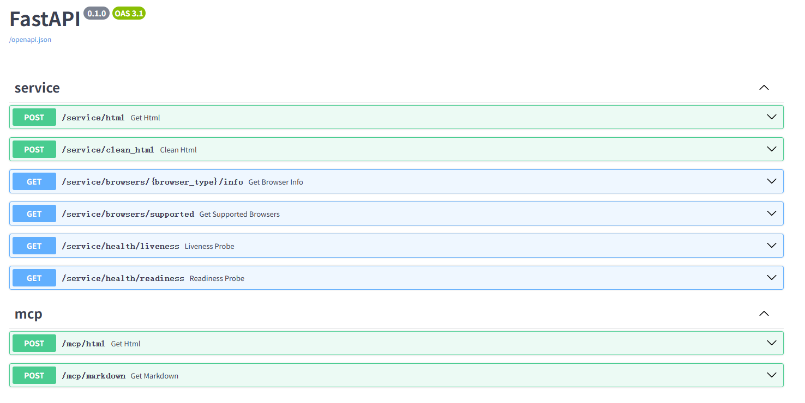
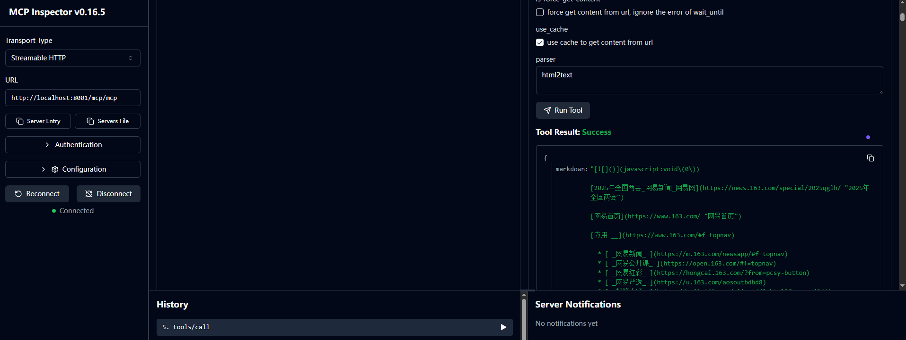
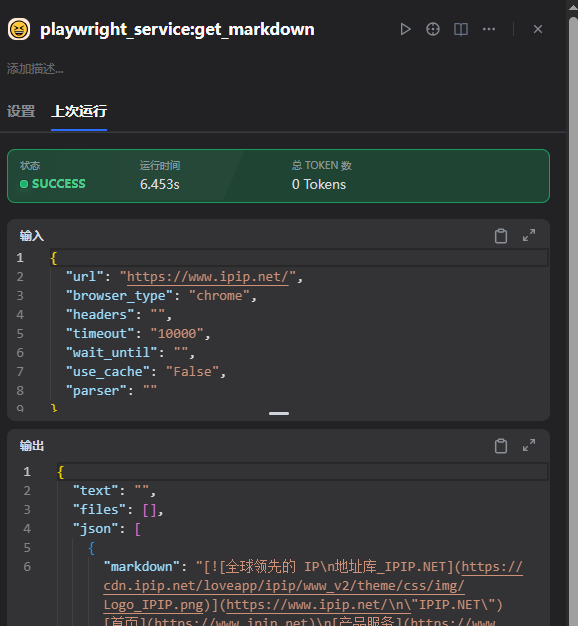

# Playwright Service
# Playwright 服务

A web scraping service built with **FastAPI**, **PostgreSQL**, **fastapi-mcp**, and **Playwright**.
一个基于 **FastAPI**、**PostgreSQL**、**fastapi-mcp** 和 **Playwright** 构建的网络爬虫服务。

It provides remote web page access with proxy support, caching, and HTML-to-Markdown conversion.
它提供远程网页访问能力，包含代理支持、缓存与 HTML 转 Markdown 等功能。

## 🚀 Technology Stack
## 🚀 技术栈

- **FastAPI** - Modern, fast web framework for building APIs
- **FastAPI** - 现代、快速的 Web 框架，用于构建 API
- **PostgreSQL** - Robust relational database for data persistence
- **PostgreSQL** - 强大的关系型数据库，用于数据持久化
- **fastapi-mcp** - Model Context Protocol integration for AI tool connectivity
- **fastapi-mcp** - 模型上下文协议集成，用于 AI 工具连接
- **Playwright** - Powerful browser automation library supporting all major browsers
- **Playwright** - 强大的浏览器自动化库，支持所有主流浏览器
- **SQLModel** - SQL database in Python, designed for simplicity and compatibility
- **SQLModel** - Python 中的 SQL 数据库层，设计简洁且兼容性强
- **Alembic** - Database migration tool
- **Alembic** - 数据库迁移工具

## 👀 Preview
## 👀 预览

OpenAPI docs preview:
OpenAPI 文档预览：



Inspector preview:
检查器预览：



Dify integration preview:
Dify 集成预览：



## ✨ Key Features
## ✨ 核心特性

### 🔄 Proxy Support
### 🔄 代理支持

- **Dynamic Proxy Pool**: Automatic proxy rotation from API endpoints
- **动态代理池**：从 API 接口自动轮换代理
- **Static Proxy**: Support for fixed proxy configurations
- **静态代理**：支持固定代理配置
- **Proxy Validation**: Built-in proxy health checking and validation
- **代理验证**：内置代理健康检查与可用性验证
- **Flexible Configuration**: Easy switching between proxy types via environment variables
- **灵活配置**：通过环境变量便捷切换代理类型

### 💾 Database Caching
### 💾 数据库缓存

- **Request History**: Automatic recording of all web requests and responses
- **请求历史**：自动记录所有网页请求与响应
- **Cache Hit Optimization**: Skip redundant requests for previously accessed URLs
- **缓存命中优化**：跳过对已访问 URL 的重复请求
- **Performance Metrics**: Track response times and status codes
- **性能指标**：跟踪响应耗时与状态码
- **Database Storage**: Persistent cache storage in PostgreSQL
- **数据库存储**：在 PostgreSQL 中持久化缓存

### 🌐 Multi-Browser Support
### 🌐 多浏览器支持

- **Based on Playwright browser support**: chrome, firefox, webkit
- **基于 Playwright 浏览器支持**：chrome、firefox、webkit
- **Resource Optimization**: Auto-block media (images/videos/audio) for better performance
- **资源优化**：自动阻止媒体资源（图片/视频/音频）以提升性能

### 📝 HTML to Markdown Conversion
### 📝 HTML 转 Markdown 转换

- **Multiple Parsers**: Support for `html2text` and `markdownify`
- **多种解析器**：支持 `html2text` 与 `markdownify`
- **Content Cleaning**: Optimized HTML processing for cleaner markdown output
- **内容清理**：优化 HTML 处理流程，输出更干净的 markdown

## 🇨🇳 Optimization for Chinese Websites (Encoding / Mojibake Fix)
## 🇨🇳 面向中文网站的优化（编码/乱码修复）

Many Chinese websites still serve pages in legacy encodings like GBK/GB2312, sometimes without a correct `charset` in the `Content-Type` header.
不少中文网站仍使用 GBK/GB2312 等历史编码，并且经常在 `Content-Type` 响应头中缺失或写错 `charset`。

When the browser can’t infer the right charset, you may see mojibake (garbled text) and `page.content()` may return incorrect HTML.
当浏览器无法正确推断编码时，就会出现乱码，且 `page.content()` 读到的 HTML 也可能不正确。

This project includes an encoding interceptor: `create_encoding_route_handler` in `encoding_utils.py`.
本项目内置了编码拦截器：`encoding_utils.py` 中的 `create_encoding_route_handler`。

It hooks Playwright `page.route("**/*", ...)`, intercepts HTML responses, detects charset from the HTML `<meta ... charset=...>` (and headers), and transcodes non-UTF-8 HTML to UTF-8.
它通过 Playwright 的 `page.route("**/*", ...)` 拦截 HTML 响应，从 HTML 的 `<meta ... charset=...>`（以及响应头）探测编码，并将非 UTF-8 的 HTML 转码为 UTF-8。

It also rewrites the response header to `text/html; charset=utf-8`, so Playwright renders correctly and screenshots/DOM extraction are stable.
同时会把响应头改写为 `text/html; charset=utf-8`，从而让 Playwright 渲染正确，截图与 DOM/内容提取更稳定。

The service enables this handler before navigation (see `apis/utils.py`), so it works transparently for both HTML fetching and screenshots.
服务会在页面跳转前启用该处理器（见 `apis/utils.py`），因此对“抓取 HTML”和“网页截图”两条链路都是透明生效的。

Related helpers include `decode_html_content()` and `fix_garbled_html()` for decoding and repairing garbled HTML bytes/strings.
相关辅助函数还包括 `decode_html_content()` 与 `fix_garbled_html()`，用于解码与修复可能已发生乱码的 HTML 字节/字符串。

## 🎯 Use Cases
## 🎯 使用场景

### Remote Web Page Access Service
### 远程网页访问服务

- **Web Scraping**: Extract content from dynamic websites
- **网络爬虫**：从动态网站提取内容
- **Content Monitoring**: Track changes in web pages over time
- **内容监控**：跟踪网页随时间的变化
- **Data Collection**: Gather structured data from various web sources
- **数据收集**：从各种网页来源收集结构化数据

### MCP (Model Context Protocol) Integration
### MCP（模型上下文协议）集成

- **AI Tool Connectivity**: Seamless integration with AI models and tools (e.g. Dify)
- **AI 工具连接**：与 AI 模型与工具无缝集成（例如 Dify）
- **Automated Web Research**: Enable AI agents to browse and analyze web content
- **自动化网页研究**：让 AI Agent 能浏览并分析网页内容
- **Content Processing**: Convert web content to markdown for AI consumption
- **内容处理**：将网页内容转换为 markdown 以便 AI 使用
- **Scalable Architecture**: Handle multiple concurrent requests efficiently
- **可扩展架构**：高效处理多个并发请求

## 🚀 Quick Start
## 🚀 快速开始

### Prerequisites
### 前置要求

- Docker and Docker Compose
- Docker 和 Docker Compose
- Recommend at least 6GB RAM available for the service
- 建议至少 6GB 可用内存

### Installation
### 安装

1. **Clone the repository**
1. **克隆仓库**
   ```bash
   git clone git@github.com:zxjlm/playwright-service.git
   cd playwright-service
   ```

2. **Start the service**
2. **启动服务**
   ```bash
   docker compose -f docker-compose.prod.yml up -d
   ```

3. **Access the service**
3. **访问服务**
   - API Documentation: http://localhost:8001/docs
   - API 文档：http://localhost:8001/docs
   - Health Check: http://localhost:8001/health
   - 健康检查：http://localhost:8001/health
   - MCP Endpoints: http://localhost:8001/mcp/
   - MCP 端点：http://localhost:8001/mcp/

3.1 **Or use inspector**
3.1 **或使用检查器**

   ```bash
   make start-inspector
   ```

### Environment Configuration
### 环境配置

Create a `.env` file with your configuration:
创建 `.env` 文件并配置：

```env
# Database Configuration
POSTGRES_USER=postgres
POSTGRES_PASSWORD=postgres
POSTGRES_DB=playwright_service
SERVICE_DATABASE_URL=postgresql+asyncpg://postgres:postgres@db:5432/playwright_service

# Proxy Configuration
PROXY_TYPE=dynamic  # or "static"
PROXY_API_URL=http://your-proxy-api.com/get
PROXY_CHECK_URL=http://httpbin.org/ip
STATIC_PROXY=http://127.0.0.1:8080
```

### About `PROXY_API_URL`
### 关于 `PROXY_API_URL`

The proxy configured here will be applied to Playwright outbound requests.
这里配置的代理会应用于 Playwright 发起的对外请求。

For **dynamic** proxies, provide an API URL that returns a proxy address like `http://127.0.0.1:7890` via GET.
对于**动态代理**，请提供一个 API URL（GET）用于返回形如 `http://127.0.0.1:7890` 的代理地址。

For **static** proxies, set `STATIC_PROXY` to a long-lived proxy like `http://127.0.0.1:7890`.
对于**静态代理**，请将 `STATIC_PROXY` 设置为可长期使用的代理，例如 `http://127.0.0.1:7890`。

If any proxy is configured, `PROXY_TYPE` must be set to declare the proxy mode.
只要配置了代理，就必须设置 `PROXY_TYPE` 来声明代理类型。

## 🔧 Configuration Options
## 🔧 配置选项

### Browser Configuration
### 浏览器配置

- **Browser Type**: Choose between Chrome, Firefox, Safari, or Edge
- **浏览器类型**：在 Chrome、Firefox、Safari 或 Edge 之间选择
- **Headless Mode**: Run browsers in headless mode for server environments
- **无头模式**：适用于服务器环境的无头运行
- **Timeout Settings**: Configurable page load timeouts
- **超时设置**：可配置的页面加载超时
- **Wait Strategies**: Customizable wait conditions for page loading
- **等待策略**：可自定义的页面加载等待条件

### Performance Settings
### 性能设置

- **Concurrent Requests**: Semaphore-based request limiting
- **并发请求**：基于信号量的请求限流
- **Resource Blocking**: Automatic blocking of media resources
- **资源阻止**：自动阻止媒体资源加载
- **Memory Management**: Automatic browser cleanup after idle periods
- **内存管理**：空闲后自动清理浏览器实例
- **Connection Pooling**: Optimized database connection management
- **连接池**：优化的数据库连接管理

## 🛠️ Development
## 🛠️ 开发

### Local Development Setup
### 本地开发设置

```bash
# Install dependencies
uv sync

# Run database migrations
uv run alembic upgrade head

# Start the development server
uv run uvicorn main:app --reload --host 0.0.0.0 --port 8000
```

### Testing
### 测试

```bash
# Run tests
uv run pytest

# Run linting
uv run ruff check .
```

## 🔮 Future Roadmap
## 🔮 未来路线图

### Phase 1: Auth
### 第一阶段：认证

- **Bearer auth**
- **Bearer 认证**
- **OAuth**
- **OAuth 认证**
- **Custom auth plugin**
- **自定义认证插件**

### Phase 2: Frontend Dashboard
### 第二阶段：前端仪表板

- **Web Interface**: Create a comprehensive frontend dashboard
- **Web 界面**：创建完整的前端仪表板
- **Request History Visualization**: Display cached requests and performance metrics
- **请求历史可视化**：展示缓存请求与性能指标
- **Real-time Monitoring**: Live monitoring of service performance
- **实时监控**：服务性能实时监控
- **Configuration Management**: Web-based configuration interface
- **配置管理**：基于 Web 的配置界面

### Phase 3: Performance Optimization
### 第三阶段：性能优化

- **Request Queuing**: Advanced request queuing and prioritization
- **请求队列**：更高级的排队与优先级机制
- **Load Balancing**: Multi-instance deployment support
- **负载均衡**：多实例部署支持
- **Caching Strategies**: Redis integration for enhanced caching
- **缓存策略**：引入 Redis 增强缓存
- **Resource Optimization**: Memory and CPU usage optimization
- **资源优化**：优化内存与 CPU 使用

### Phase 4: Enhanced HTML Processing
### 第四阶段：增强 HTML 处理

- **Custom Plugins**: Support for custom HTML compression plugins
- **自定义插件**：支持自定义 HTML 压缩插件
- **Markdown Parser Optimization**: Improved HTML-to-Markdown conversion
- **Markdown 解析优化**：改进 HTML 转 Markdown
- **Content Extraction**: Advanced content extraction algorithms
- **内容提取**：更高级的内容提取算法
- **Format Support**: Additional output formats (JSON, XML, etc.)
- **格式支持**：更多输出格式（JSON、XML 等）

## 🤝 Contributing
## 🤝 贡献

We welcome contributions! Please feel free to submit issues and pull requests.
欢迎贡献！请随时提交 Issue 或 Pull Request。

## 📄 License
## 📄 许可证

This project is licensed under the GNU GENERAL PUBLIC LICENSE - see the [LICENSE](LICENSE) file for details.
本项目采用 GNU 通用公共许可证，详情请参阅 [LICENSE](LICENSE) 文件。
