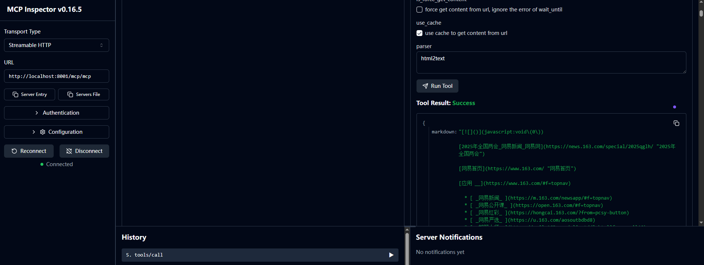

# Playwright 服务

一个基于 **FastAPI**、**PostgreSQL**、**fastapi-mcp** 和 **Playwright** 构建的网络爬虫服务。该服务提供远程网页访问功能，具有代理支持、缓存和HTML转Markdown转换等高级特性。

## 🚀 技术栈

- **FastAPI** - 现代、快速的Web框架，用于构建API
- **PostgreSQL** - 强大的关系型数据库，用于数据持久化
- **fastapi-mcp** - 模型上下文协议集成，用于AI工具连接
- **Playwright** - 强大的浏览器自动化库，支持所有主流浏览器
- **SQLModel** - Python中的SQL数据库，设计简洁且兼容性强
- **Alembic** - 数据库迁移工具

## 👀 预览





## ✨ 核心特性

### 🔄 代理支持
- **动态代理池**：从API接口自动轮换代理
- **静态代理**：支持固定代理配置
- **代理验证**：可配置的代理健康检查和验证

### 💾 数据库缓存
- **请求历史**：自动记录所有网络请求和响应
- **缓存命中优化**：跳过对之前访问过的URL的重复请求
- **性能指标**：跟踪响应时间和状态码
- **数据库存储**：在PostgreSQL中持久化缓存存储

### 🌐 多浏览器支持
- **基于 playwright 浏览器支持**: chrome, firefox, webkit
- **资源优化**：自动阻止媒体资源（图片、视频、音频）以提升性能

### 📝 HTML转Markdown转换
- **多种解析器**：支持 `html2text` 和 `markdownify` 库
- **内容清理**：优化的HTML处理，提供更好的markdown输出

## 🎯 使用场景

### 远程网页访问服务
- **网络爬虫**：从动态网站提取内容
- **内容监控**：跟踪网页随时间的变化
- **数据收集**：从各种网络源收集结构化数据

### MCP（模型上下文协议）集成
- **AI工具连接**：与AI模型和工具无缝集成(如 dify 配置)
- **自动化网络研究**：使AI代理能够浏览和分析网络内容
- **内容处理**：将网络内容转换为markdown供AI使用
- **可扩展架构**：高效处理多个并发请求


## 🚀 快速开始

### 前置要求
- Docker 和 Docker Compose
- 建议至少6GB可用内存

### 安装

1. **克隆仓库**
   ```bash
   git clone git@github.com:zxjlm/playwright-service.git
   cd playwright-service
   ```

2. **启动服务**
   ```bash
   docker compose -f docker-compose.prod.yml up -d
   ```

3. **访问服务**
   - API文档：http://localhost:8001/docs
   - 健康检查：http://localhost:8001/health
   - MCP端点：http://localhost:8001/mcp/

3.1 **或使用检查器**

   ```bash
   make start-inspector
   ```

### 环境配置

创建 `.env` 文件并配置：

```env
# 数据库配置
POSTGRES_USER=postgres
POSTGRES_PASSWORD=postgres
POSTGRES_DB=playwright_service
SERVICE_DATABASE_URL=postgresql+asyncpg://postgres:postgres@db:5432/playwright_service

# 代理配置
PROXY_TYPE=dynamic  # 或 "static"
PROXY_API_URL=http://your-proxy-api.com/get
PROXY_CHECK_URL=http://httpbin.org/ip
STATIC_PROXY=http://127.0.0.1:8080
```

### 关于 PROXY_API_URL

本项目使用的代理将应用于Playwright服务请求。
对于动态代理，它们必须以URL形式提供，并支持通过GET方法获取格式为 http://127.0.0.1:7890 的代理地址。
对于静态代理，提供的格式为 http://127.0.0.1:7890 的代理将直接应用于服务请求。请确保静态代理可以长期使用。
请注意，如果配置了代理，必须指定PROXY_TYPE来声明代理类型。

## 🔧 配置选项

### 浏览器配置
- **浏览器类型**：在Chrome、Firefox、Safari或Edge之间选择
- **无头模式**：在服务器环境中以无头模式运行浏览器
- **超时设置**：可配置的页面加载超时
- **等待策略**：可自定义的页面加载等待条件

### 性能设置
- **并发请求**：基于信号量的请求限制
- **资源阻止**：自动阻止媒体资源
- **内存管理**：空闲期后自动清理浏览器
- **连接池**：优化的数据库连接管理

## 🛠️ 开发

### 本地开发设置
```bash
# 安装依赖
uv sync

# 运行数据库迁移
uv run alembic upgrade head

# 启动开发服务器
uv run uvicorn main:app --reload --host 0.0.0.0 --port 8000
```

### 测试
```bash
# 运行测试
uv run pytest

# 运行代码检查
uv run ruff check .
```

## 🔮 未来路线图

### 第一阶段：认证
- **Bearer认证**
- **OAuth认证**
- **自定义认证插件**

### 第二阶段：前端仪表板
- **Web界面**：创建全面的前端仪表板
- **请求历史可视化**：显示缓存的请求和性能指标
- **实时监控**：服务性能的实时监控
- **配置管理**：基于Web的配置界面

### 第三阶段：性能优化
- **请求队列**：高级请求队列和优先级排序
- **负载均衡**：多实例部署支持
- **缓存策略**：Redis集成以增强缓存
- **资源优化**：内存和CPU使用优化

### 第四阶段：增强的HTML处理
- **自定义插件**：支持自定义HTML压缩插件
- **Markdown解析器优化**：改进的HTML到Markdown转换
- **内容提取**：高级内容提取算法
- **格式支持**：额外的输出格式（JSON、XML等）

## 🤝 贡献

我们欢迎贡献！请随时提交问题和拉取请求。

## 📄 许可证

本项目采用GNU通用公共许可证 - 详情请参阅 [LICENSE](LICENSE) 文件。
