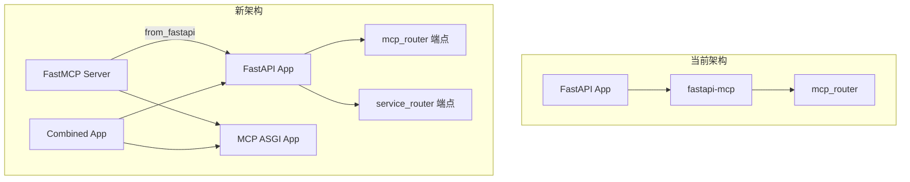

# 从 fastapi-mcp 迁移到 FastMCP 3.0

## 当前架构

当前项目使用 `fastapi-mcp` 包，在 [main.py](main.py) 中：

```python
from fastapi_mcp import FastApiMCP

mcp = FastApiMCP(app, include_tags=["mcp"])
mcp.mount_http(mcp_router)
mcp.setup_server()
```

MCP 端点定义在 [apis/mcp_router.py](apis/mcp_router.py)：

- `POST /mcp/html` - 获取网页 HTML（operation_id: `playwright_service:get_html`）
- `POST /mcp/markdown` - 获取网页 Markdown（operation_id: `playwright_service:get_markdown`）

## 迁移方案

使用 FastMCP 3.0 的 `FastMCP.from_fastapi()` 方法，自动将 FastAPI 端点转换为 MCP 工具。

### 架构变更



## 主要修改

### 1. 修改 main.py

- 移除 `from fastapi_mcp import FastApiMCP`
- 添加 `from fastmcp import FastMCP`
- 添加 `from fastmcp.utilities.lifespan import combine_lifespans`
- 使用 `FastMCP.from_fastapi()` 从 FastAPI 应用生成 MCP 服务器
- 使用 `combine_lifespans()` 合并原有 lifespan 和 MCP lifespan
- 创建合并后的 FastAPI 应用，同时提供 REST API 和 MCP 端点

关键代码变更：

```python
from fastmcp import FastMCP
from fastmcp.utilities.lifespan import combine_lifespans

# 先添加路由到 app
app.include_router(service_router)
app.include_router(mcp_router)

# 从 FastAPI 生成 MCP 服务器（只包含 mcp 标签的端点）
mcp = FastMCP.from_fastapi(
    app=app, 
    name="Playwright MCP Service",
    include_tags=["mcp"]  # 只转换 mcp 标签的端点为工具
)

# 创建 MCP ASGI 应用
mcp_app = mcp.http_app(path="/mcp")

# 合并 lifespan
combined_lifespan = combine_lifespans(lifespan, mcp_app.lifespan)

# 创建最终应用
final_app = FastAPI(
    lifespan=combined_lifespan,
    routes=[*app.routes, *mcp_app.routes]
)
```

### 2. 更新 mcp_router.py（可选优化）

operation_id 会自动成为 MCP 工具名称，当前的 `playwright_service:get_html` 格式是合适的。

## 端点映射

| 原端点                | MCP 工具名称                          | 说明            |
| ------------------ | --------------------------------- | ------------- |
| POST /mcp/html     | `playwright_service:get_html`     | 获取网页 HTML     |
| POST /mcp/markdown | `playwright_service:get_markdown` | 获取网页 Markdown |

## 访问路径

迁移后：

- REST API: `http://localhost:8000/mcp/html`, `http://localhost:8000/mcp/markdown`
- MCP 端点: `http://localhost:8000/mcp`（SSE 传输）
- 监控指标: `http://localhost:8000/metrics`
